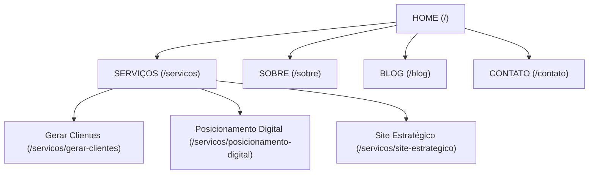

# Planejamento: Informações Globais e Técnicas

Este documento contém os elementos compartilhados e as configurações técnicas para todo o site NTA Digital.

## Visão Geral da Arquitetura

## Elementos Globais

### Header / Navegação
| Elemento | Detalhe |
|----------|---------|
| **Logo** | NTA Digital (SVG) — canto esquerdo |
| **Menu** | Home · Serviços · Sobre · Blog · Contato |
| **CTA Header** | Botão `ds-btn--primary` → "Quero gerar clientes" (WhatsApp) |
| **Comportamento** | Fixed top, blur backdrop, shrink on scroll |

### WhatsApp Floating CTA
| Elemento | Detalhe |
|----------|---------|
| **Posição** | Fixed, bottom-right, z-index alto |
| **Link** | `wa.me/5541998081519?text=Olá, quero saber como gerar mais clientes` |
| **Animação** | Pulse suave + tooltip "Fale conosco" |

### Footer
| Elemento | Detalhe |
|----------|---------|
| **Col 1** | Logo + Descrição |
| **Col 2** | Links Rápidos |
| **Col 3** | Serviços |
| **Col 4** | Contato e Redes Sociais |

## Integrações Técnicas
- **WhatsApp:** Botão flutuante + todos os CTAs.
- **Google Tag Manager:** Container GTM em todas as páginas.
- **Google Analytics 4:** Eventos de conversão via GTM.
- **Google Ads Conversion:** Tag nos botões WhatsApp e form submit.
- **Meta Pixel:** PageView, Lead, Contact via GTM.

## Breakpoints Responsivos
- `> 1200px`: Desktop
- `769–1024px`: Tablet
- `< 768px`: Mobile

## Requisitos de SEO Técnico
- LCP < 2.5s, CLS < 0.1, INP < 200ms.
- Mobile first, HTTPS, Sitemap.xml e robots.txt.
